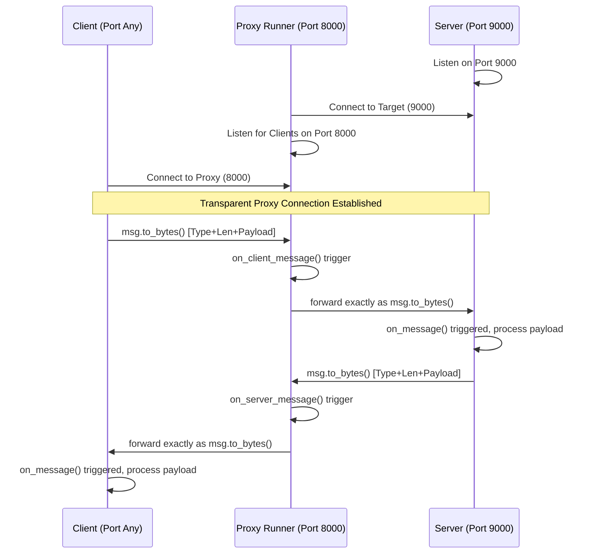

# Architecture

## System Flow Diagram



## 1. The Wire Protocol (`core.message`)

Communication inside DistributedRunner is done via a structured **Length-Prefixed Framing Protocol**. Because TCP is natively just a continuous stream of bytes, this ensures boundary tracking so receivers know exactly where one message begins and ends.

### Frame Structure

```text
[1 byte: Type Tag] [4 bytes: Length Prefix] [ <Length> bytes: Payload ]
```

- **Type Tag (1 byte):** 
  - `0x01` represents standard UTF-8 text strings.
  - `0x02` represents serialized NumPy matrices.
- **Length Prefix (4 bytes):** 
  - A 32-bit unsigned integer (big-endian/network byte order) holding the size of the *Payload* alone.

### Payload Decoding
Depending on the Type Tag, the payload is dynamically processed:
- *If Text:* Automatically decoded to `utf-8`.
- *If NumPy Array:* The payload itself is organized sequentially as `[Dtype Str Length (2B)] + [Dtype Str] + [Shape String Length (2B)] + [Shape String] + [Raw Bytebuffer]`.

## 2. Event-Driven Sockets (`core.connection`)

Manually building `while True:` socket rx-loops everywhere makes the code extremely verbose and heavily prone to "half-open connection" bugs.

The `Connection` handles:
1. **Thread Spawning:** Upon `.start()`, it spawns a background `daemon` thread entirely dedicated to pulling from the socket and reading until a boundary limit.
2. **Callbacks:** It exposes a publisher/subscriber layout. Instead of checking for output, systems provide an `on_message` and `on_disconnect` function. 

## 3. The Proxy (`runner.py`)

A runner acts as a Transparent Proxy. Because of the `Connection` architecture scaling, the runner is remarkably simple:
1. Accepts an incoming raw socket payload (acts as a Server).
2. Connects cleanly to another downstream destination (acts as a Client).
3. Assigns `client_conn.on_message` to execute `server_conn.send(msg)`.
4. Assigns `server_conn.on_message` to execute `client_conn.send(msg)`.

Message metadata (`msg.length`, `msg.type`) is intercepted and logged without changing the packet, enabling real-time monitoring of TCP traffic behavior without terminating the payload.
